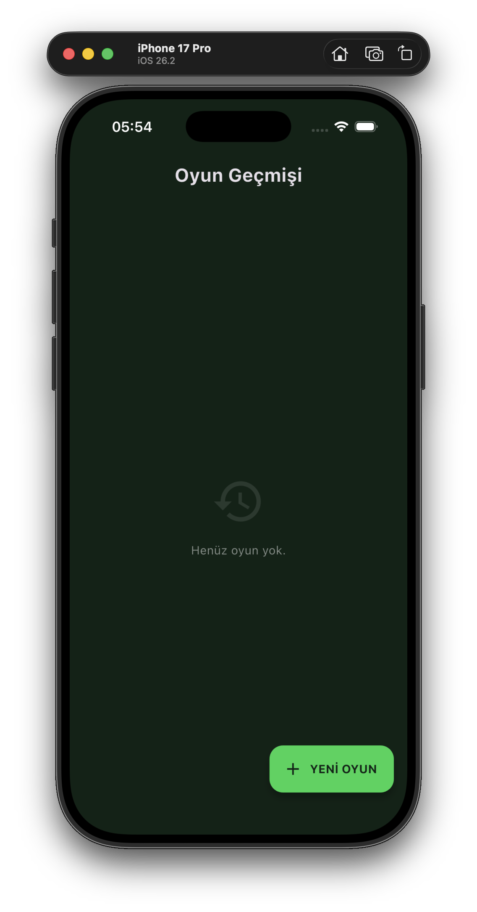
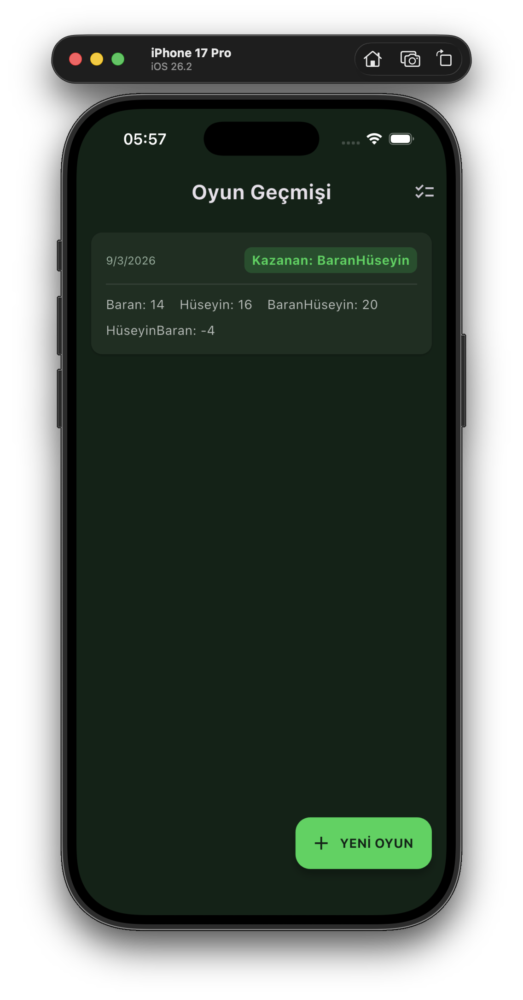
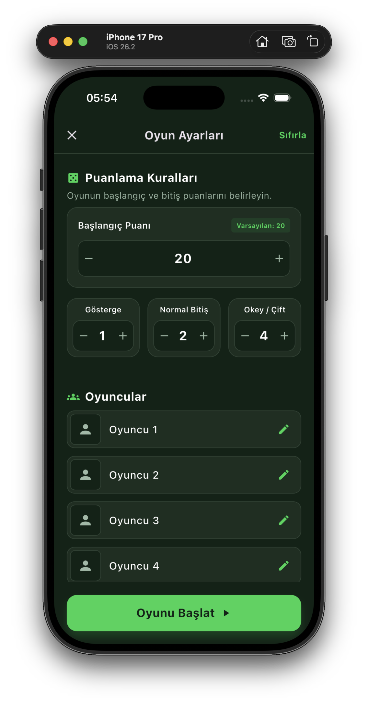
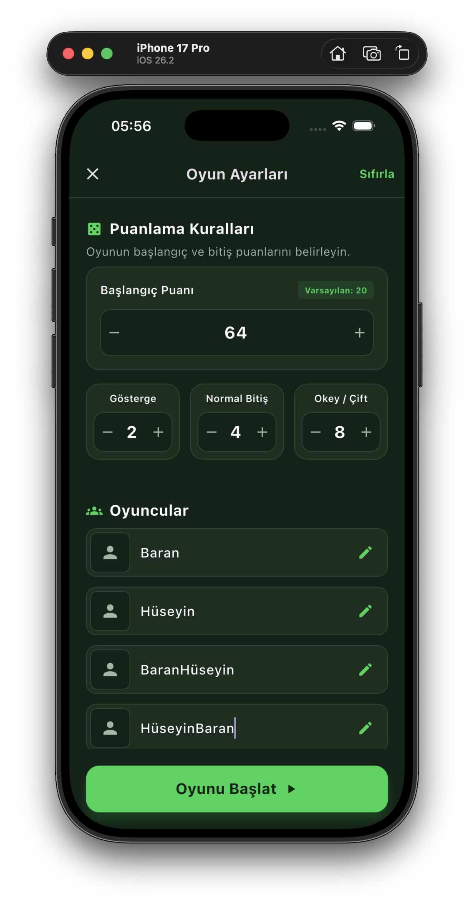
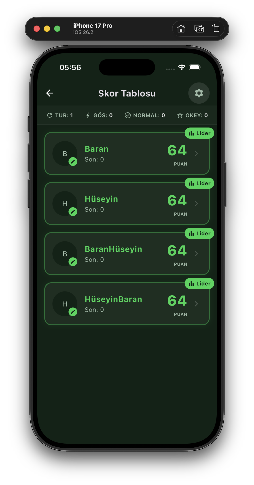
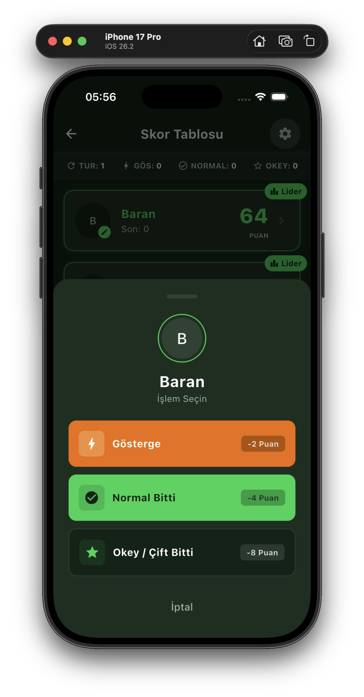
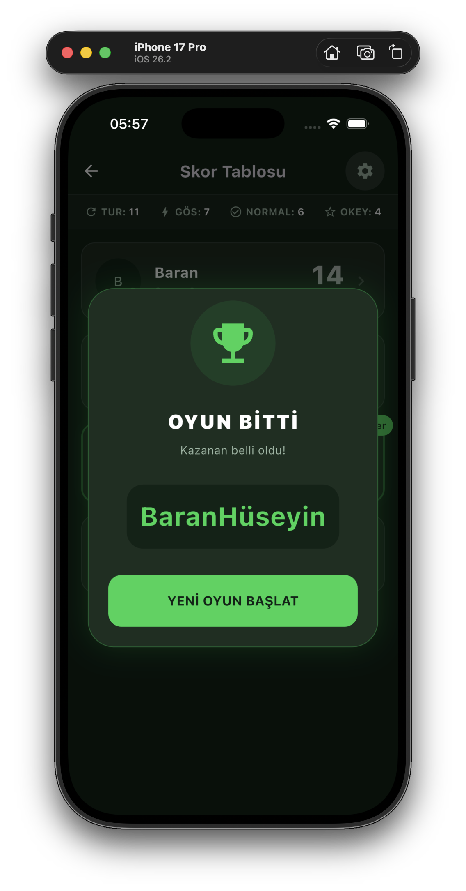
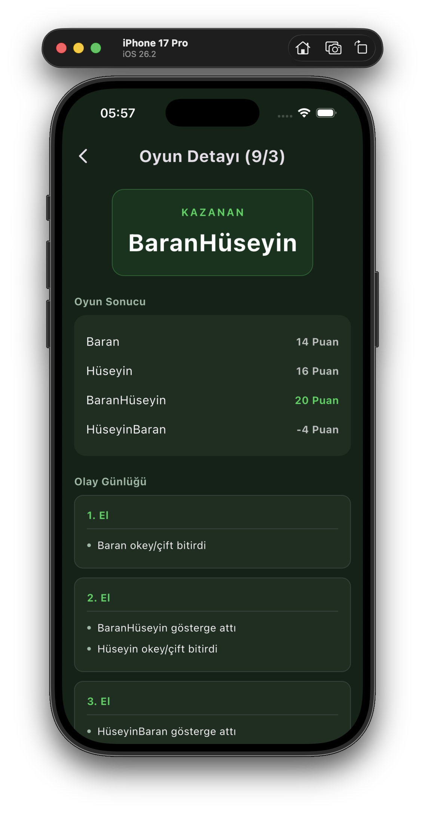
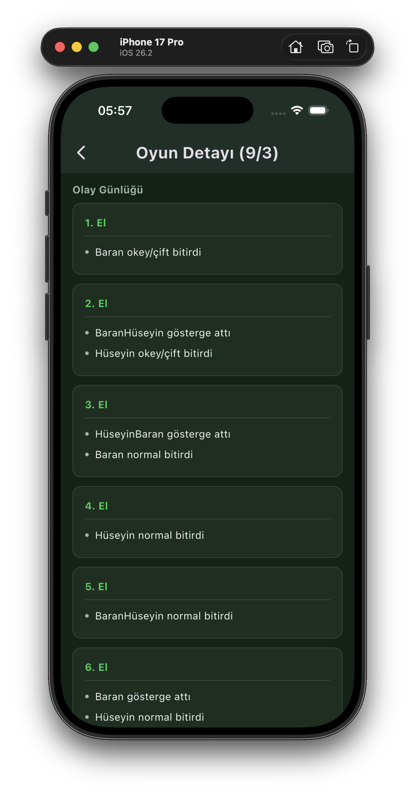
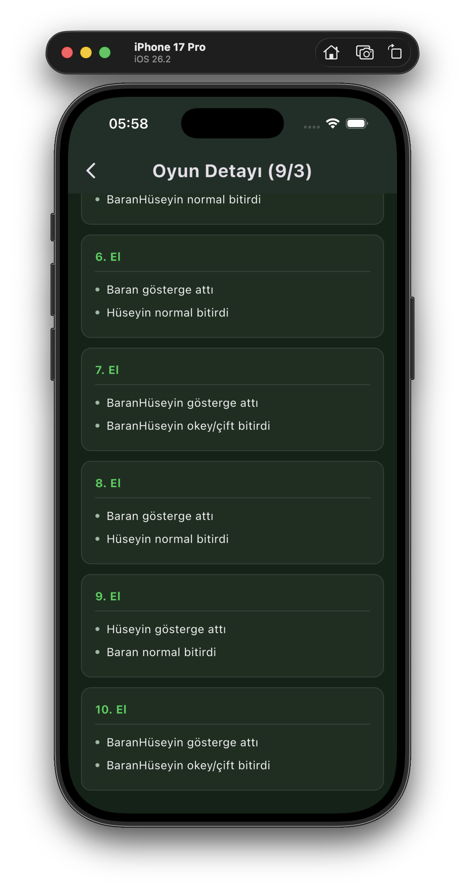

# 🀱 Okey Skor Takip

> Okey oyunlarınızda skor takibini kolaylaştıran, modern tasarımlı Flutter uygulaması.  
> Başlangıç puanı ve düşme miktarlarını kendinize göre ayarlayın, her eli kayıt altına alın, oyun geçmişinizi saklayın.

---

## 📱 Ekran Görüntüleri

### Ana Ekran & Oyun Geçmişi
| Boş Geçmiş | Oyunlar Listelenmiş |
|:---:|:---:|
|  |  |

### Oyun Kurulumu
| Varsayılan Ayarlar | Özelleştirilmiş Ayarlar |
|:---:|:---:|
|  |  |

### Oyun İçi
| Skor Tablosu | İşlem Ekranı | Kazanan |
|:---:|:---:|:---:|
|  |  |  |

### Oyun Detayı
| Oyun Detayı | Oyun Detayı | Oyun Detayı |
|:---:|:---:|:---:|
|  |  |  |

---

## ✨ Özellikler

### 🎮 Oyun Yönetimi
- **Esnek kural ayarları** — Başlangıç puanı, gösterge/normal/okey düşme miktarları oyun başında serbestçe ayarlanabilir
- **4 oyuncu desteği** — Her oyuncunun ismi özelleştirilebilir
- **Anlık skor takibi** — Her işlemden sonra puanlar otomatik güncellenir
- **Lider rozeti** — En yüksek puanlı oyuncu anında vurgulanır
- **Oyun sonu tespiti** — Herhangi bir oyuncunun puanı 0'ın altına düşünce oyun otomatik biter ve kazanan ilan edilir

### ⚡ İşlem Tipleri
| İşlem | Açıklama | Etki |
|---|---|---|
| **Gösterge** | Oyuncu gösterge attı | Diğerleri ceza alır, tur **bitmez** |
| **Normal Bitti** | Oyuncu normal bitirdi | Diğerleri ceza alır, tur **biter** |
| **Okey / Çift** | Oyuncu okey/çift bitirdi | Diğerleri 2x ceza alır, tur **biter** |

### 📋 Geçmiş & Kayıt
- **Otomatik kayıt** — Her oyun bitişinde geçmişe otomatik eklenir
- **El el olay günlüğü** — Kimin hangi elde ne yaptığı detaylıca saklanır
- **Oyun detay sayfası** — Kazanan, final skorlar ve tüm el geçmişi görüntülenebilir
- **Toplu silme** — Uzun basarak seçim moduna geçip birden fazla oyun silinebilir
- **Kalıcı depolama** — Uygulama kapatılsa da tüm veriler `SharedPreferences` ile saklanır

---

## 🛠️ Teknolojiler

| Teknoloji | Versiyon | Kullanım Amacı |
|---|---|---|
| Flutter | 3.x | UI framework |
| Dart | ^3.1.0 | Programlama dili |
| shared_preferences | ^2.5.4 | Kalıcı veri depolama |
| flutter_launcher_icons | ^0.14.4 | Uygulama ikonu yönetimi |

---

## 🚀 Kurulum

```bash
# 1. Repoyu klonla
git clone https://github.com/kullaniciadi/okey-skor-takip.git
cd okey-skor-takip

# 2. Bağımlılıkları yükle
flutter pub get

# 3. Uygulamayı çalıştır
flutter run

# Belirli bir cihaz için
flutter run -d ios
flutter run -d android
```

### Gereksinimler
- Flutter SDK 3.x veya üzeri
- Dart SDK ^3.1.0
- iOS 12+ / Android 5.0+

---

## 🎮 Nasıl Kullanılır?

1. **YENİ OYUN** butonuna bas
2. **Puanlama Kurallarını** ayarla:
    - Başlangıç puanını belirle (varsayılan: 20)
    - Gösterge, Normal Bitiş ve Okey/Çift düşme miktarlarını gir
3. **4 oyuncunun ismini** gir, kalem ikonuna basarak düzenle
4. **Oyunu Başlat**'a bas
5. Oyun ekranında bir oyuncunun kartına dokun → işlem seç:
    - ⚡ **Gösterge** — Sadece ceza düşer, tur devam eder
    - ✅ **Normal Bitti** — Tur biter, diğerleri belirtilen puan kadar düşer
    - ⭐ **Okey / Çift Bitti** — Tur biter, diğerleri 2 katı ceza alır
6. Puan 0'ın altına düştüğünde oyun biter, kazanan ilan edilir ve geçmişe kaydedilir
7. Geçmiş ekranında herhangi bir oyuna dokunarak detayları görebilirsin

---

## 📁 Proje Yapısı

```
lib/
├── main.dart               # Uygulama giriş noktası, tema ayarları
├── core.dart               # Renkler (AppColors), veri modelleri
│                           # └── Player, GameRecord, GameLog
├── history_page.dart       # Ana ekran — oyun geçmişi listesi & seçim modu
├── setup_page.dart         # Oyun kurulum ekranı, StepperInput widget
├── game_page.dart          # Aktif oyun — skor tablosu & modal işlem ekranı
├── game_detail_page.dart   # Geçmiş oyun detayı — sonuç & olay günlüğü
└── history_service.dart    # SharedPreferences ile CRUD işlemleri

screenshots/
├── anaekran.png
├── anaekran_oyungecmisleri.png
├── oyunayarlari.png
├── oyunayarlari_degistirme.png
├── skortablosu_oyunbasi.png
├── islemekrani.png
├── kazanan.png
├── oyundetayi_1.png
├── oyundetayi_2.png
└── oyundetayi_3.png
```

---

## 🎨 Renk Paleti

| Renk | Hex | Kullanım |
|---|---|---|
| 🟢 Primary Green | `#11D452` | Butonlar, lider rozeti, kazanan vurgusu |
| 🌑 Background Dark | `#102216` | Ana arka plan |
| 🟫 Surface Dark | `#1C2E21` | Kartlar, modal arka planı |
| Border Dark | `#2D4233` | Kenarlıklar, ayraçlar |
| Text Secondary | `#9DB9A6` | İkincil metinler, istatistikler |

---

## 📄 Lisans

MIT License — dilediğiniz gibi kullanabilir, geliştirebilir ve dağıtabilirsiniz.
